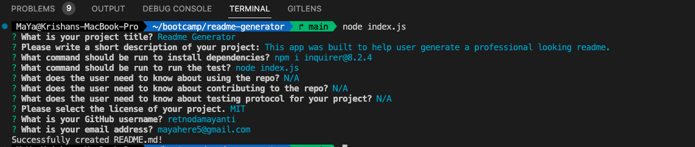
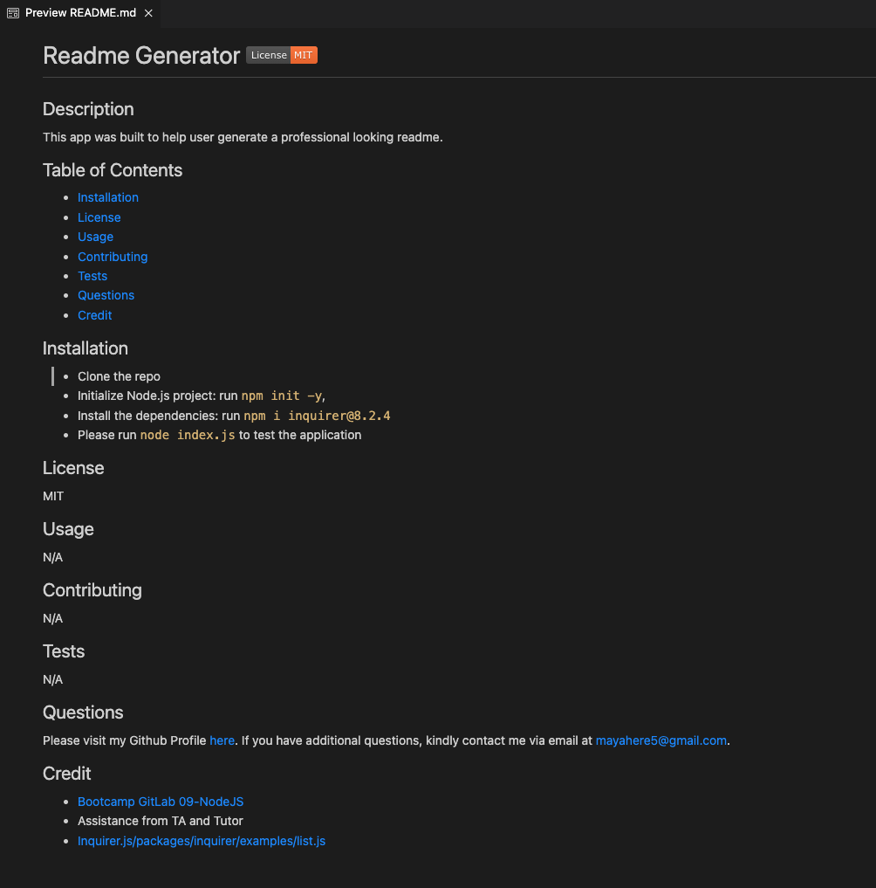

# Readme Generator - Node.js 

## Description

This application was built using command-line application using Node.js that generates a README.md file based on the user input. It will help user to quickly create a README.md file with all the necessary information and sections for a project.
Please visit a video demonstrating the application [here](https://drive.google.com/file/d/1y9fLhrap601nVIFwm3iBumoo_H4Fkb9S/view?usp=sharing).

## Table of Contents
- [Installation](#installation)
- [Usage](#usage)
- [Contributing](#contributing)
- [Tests](#tests)
- [Questions](#questions)
- [Credit](#credit)
- [License](#license)

## Installation
- Clone the repo
- Initialize Node.js project: run `npm init -y`
- Install the dependencies: run `npm i inquirer@8.2.4`
- Please run `node index.js` to test the application

## Usage 
1. Screenshot below shows the command-line application

2. Screenshot below shows the generated README.md file

## Contributing
N/A 

## Tests
N/A

## Questions
Please visit my Github Profile [here](https://github.com/retnodamayanti). If you have additional questions, kindly contact me via email at mayahere5@gmail.com.
 
## Credit
- [Bootcamp GitLab 09-NodeJS](https://git.bootcampcontent.com/University-of-Adelaide/UADEL-VIRT-FSF-PT-03-2023-U-LOLC/-/tree/main/09-NodeJS) 
- Assistance from TA and Tutor
- [Inquirer.js/packages/inquirer/examples/list.js](https://github.com/SBoudrias/Inquirer.js/blob/master/packages/inquirer/examples/list.js)

## License
Please refer to the LICENSE in the repo.